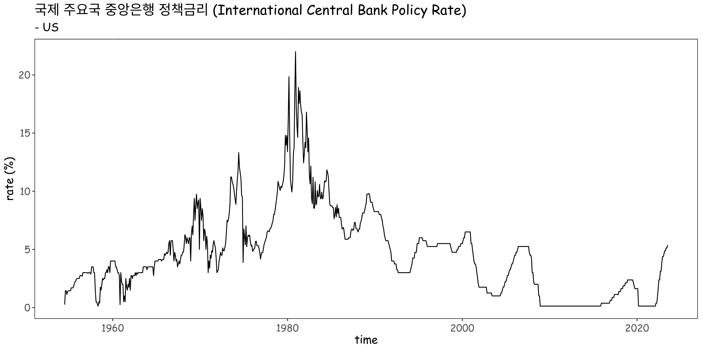

# ecos package

<!-- badges: start -->

[](https://cran.r-project.org/package=ecos) [](https://github.com/seokhoonj/ecos/actions/workflows/R-CMD-check.yaml)

<!-- badges: end -->

## Introduction

한국은행 경제통계시스템\
Economic Statistics System of Bank of Korea (Open API Service)\
(<https://ecos.bok.or.kr/api/#/>)

## Installation

``` r
# install from CRAN
install.packages("ecos")

# Alternatively
devtools::install_github("seokhoonj/ecos")  
```

## Examples

``` r
library(ecos)

# set your api key
ecos.setKey(api_key = "your_api_key")

# or permanently
usethis::edit_r_environ() # add KOSIS_API_KEY="your_api_key" in .Renviron

# data search (if you don't know the stat_code / item_code)
interest_rate <- statSearch()
Please insert stat_code: 902Y006
Please insert item_code1: US

# or simply
interest_rate <- statSearch(stat_code = "902Y006", item_code1 = "US", cycle = "M")
```

An example of plot using central bank policy rate data (US) from ECOS 
